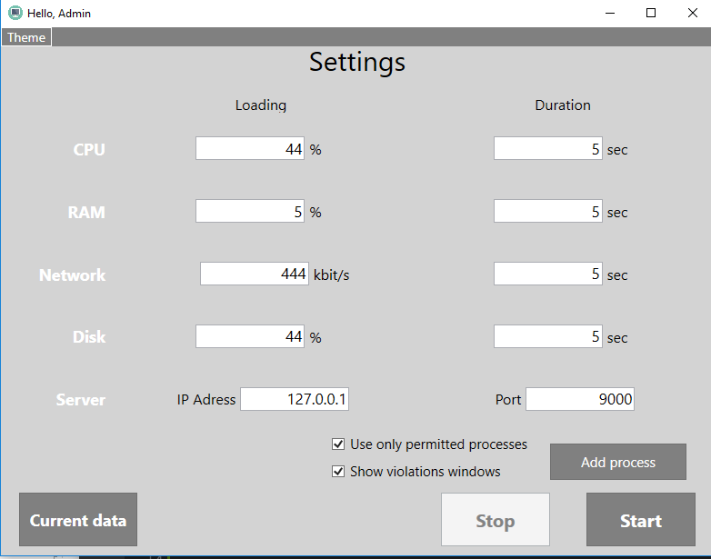

# Windows Watcher
### Author: Khloptsau Andrei gr.653503
## Description
The load detector under Windows. Window program with installer. Peculiar watcher for the system. When the program starts, a window will appear with system parameters such as CPU, RAM, GPU, Network, etc. in it we will be able to set the limits of the load on these parameters, and the maximum allowable time of the excess load. When the program starts, it hides in the background and it becomes not visible (if you don’t know what to find). If any of the system parameters exceeds the allowed value more than the time set for it, an error message will be displayed on the screen. (can be disabled), there is also a remote mode where this message is sent to the specified local server. You can also set a list of allowed processes, when undesirable occurrences, an error is also signaled.

Application of the program - a kind of system scanner, showing unwanted, hidden activity (viruses, third-party software).

In remote mode, it is useful for controlling equipment (for example, during an exam), when the server will have messages that left software has been connected, flash drives, or unauthorized Internet access has been made.

***
### Автор: Хлопцев Андрей гр.653503
## Описание
Сигнализатор нагрузки под Windows. Оконная программа с установочником. Своеобразный Watcher для системы. При запуске программы, будет появляться окно с параметрами системы, такие как CPU, RAM, GPU, Network и т.д. в ней мы сможем установить предельные границы нагрузки на данные параметры, и максимально допустимое время превышенной нагрузки. При старте программы, она прячется в фон и её становится не видно (если не знать, что надо найти). Если какой-то из параметров системы будет превышать допустимое значение больше, чем ему установленно времени, на экран будет подаваться сообщение об ошибке. (можно отключить), так же есть удаленный режим, где данное сообщение посылается на заданный локальный сервер. Так же можно задать список разрешенных процессов, при появлении нежелательных, так же сигнализируется об ошибке.

Применение программы - своеобразный сканер системы, показывающий нежелательную, скрытую активность (вирусы, стороннее по).

В удаленном режиме полезна для контроля техники (например, при экзамене), когда на сервере будут сообщения, что были подключены левые ПО, флешки или произведён несанкционированный доступ в интернет.

## Используемые технологии

+ .NET Framework 4.6.1
+ C# 7.0
+ Windows Presentation Foundation (WPF)
+ EntityFramework 6

## Возможности приложения
1. Приложение позволяет получать текущую нагрузку системы и информировать пользователя при её превышении
2. Приложение позволяет регистрировать процессы и информировать пользователя о поялении незарегистрированных процессов
3. Приложение позволяет отслеживать подключение незарегистрированных флеш карт
4. Посволяет просматривать текущую нагрузку системы
5. Поддерживает работу с удалённым сервером для отправки сообщений на него
6. Поддерживает кеширование настроек для каждого пользователя, и их восстановлении при каждом запуке
7. Работу с пользователями, создание отдельно папки с информацией для каждого нового пользователя
8. Регистрация новых пользователей
9. Разделение ролей для пользователей: администраторы - полное управление программой, обыный пользователь - просмотр текущей нагрузки системы и запуск сканирования
10. Поддерживает отдельное логгирование для каждого пользователя
11. Включена поддержка 2-х языков, Русского и Английского
12. Включена поддержка нескольких тем: Светлой и Тёмной
13. Создано консольное приложение для запуска TCP сервера и набором комманд для его управления
14. Созданны установчники для сервера и приложения

## Алгоритм

Для мониторинга характеристик компьютера, как ОЗУ, ЦПУ и нагрузки на дисковую систему используется класс PerfomanceCounter из пространства имен System.Diagnostics, который может получать прямой доступ к данным операционной системы и считывать их. Для мониторинга нагрузки на сеть используется комбинация 2 Couter: Bytes Sent/sec и Bytes Received/sec, сложение их выводов и даёт нам полную нагрузку на сеть.

Для работы с сервером была написана специальная программа-сервер, создающее соединение по TCP протоколу. Для её реализации были использованы классы WatsonServer и WatsonClient из пространства имён WatsonTcp.

## Архитектура 

Проект построен из 2-х приложений: консольного, для поднятия и мониторинга сервера и основного WPF приложения

Основное приложение построено на технологии WPF и включает в себя 5 окон:
* Окно авторизации
* Окно регистрации
* Рабочее окно
* Окно работы с процессами
* Окно текущей нагрузки

За работу приложения отвечает MonitoringModel, которая соеденяет работу всех менеджеров программы.
Список менеджеров:
* Loader - запускается в одном из потоков ThreadPool для сканирования системы. Создан для проверки нагрузки системы
* ConfigurationManager - служит для сохранения, восстановления и кеширования настроек приложения для каждого пользователя
* FileManager - служит для хранения всех рабочих путей, а также проверки папок/файлов и их создания
* LoggerManager - служит для логгирования ошибок программы и выявленных нарушений
* ProcessManager - служит для работы с регистрацией процессов и флешек, а также сканирование системы на незарегистрированные объекты
* ServerManager - служит для создания соединения с клиента и отправки сообщений на сервер
* UserManager - необходим для работы с базой данных пользователей, в которой содержатсязарегистрированные пользователи, их роли, а также некоторые выбранные ими настройки (для работы с сервером, язык приложения и выбранная тема)

Также в основное приложения входят:
* Файлы ресурсов (локализации), для поддержки нескольких языков
* Словари ресурсов, для поддержки смены темы рабочего приложения

## Установка

Для клиента и для сервера предусмотрены отдельные установщики, работающие одинаковым образом. Программа: MonitorToolInstallerr.msi, сервер: ServerInstaller.msi. (Данные программы могут быть найдены в *имя_установочника*/Debug). Процесс установки такой же, как и других программ под Windows.

**Примечание:** На некоторых версиях Windows программа может быть установлена с дефолтным ярлыком. При полученнии такой проблемы попробуйте перезагрузить Windows. Если проблема не была устранена, картинка ярлыка может быть найдена в папке установленной программы.

## Использование

### Клиент

#### Интерфейс

При запуске приложения открывается окно авторизации:


Для запуска приложения требуется ввести валидные данные, выбрать язык приложения и нажать кнопку **Enter**. При попыте войти под некорректным пользователем будет выведено следущее сообщение.


Для работы программы были созданы пользователи 2 типов: администраторы и пользователи. Администраторы имеют полный доступ к настройке программы, а пользователи могут просматривать текущую нагрузку системы и так же запускать и останавливать сканирование. Для настройки программы был создан специальный пользователь: Login =  *Admin*, Password =  *123456*. Для добавление своих собственных пользователей нажмите на кнопку **Registration**. При клике на данную кнопку появится следующее окно:


После корректного запуска приложения будет загружено рабочее окно:



В зависимости от роли вашего пользователя, вам будет доступна настройка приложения. Тут вам предлагается выбрать критическое значение для параметров и максимально допустимое время превышения критического значения. После запуска программы, окно будет спрятано в панель скрытых значков Windows:


Для открытия окна снова, просто сделайте ЛКМ на значке.

При превышении какого-либо параметра, при установленой галочке *Показывать окна нарушений*(зависит от языка) будет выведено, примерно, следующее окно:


Так же в программу добавлена работа по отслеживанию процессов и USB флешек. Для работы с процессами нажмите на кнопку *Добавить процесс*. По нажатию появится следущее окно: 


В данном окне вы можете:
* Регистрировать все текущие процессы системы (кнопка: Add all)
* Регистрировать свой личный процесс (кнопка: Add)
* Очищать список зарегистрированных процессов (кнопка: Remove All)
* Удалять выбранный процесс из списка зарегистрированнх (кнопка: Remove)

Сканирование системных процессов начнётся после регистрирования разрешённых процессов и включенного checkbox *Использовать только разрешённые процессы*. Так же, после включения данной настройки в программе будет создан список подключённых в данный момент USB флешек, и при появлении нового девайса в процессе работы или появления незарегестрированного процесса будут выведены, примерно, такие окна: 


При нажатии на кнопку *Current data* показывает окно текущей нагрузки на систему:


Данное останется даже после скрытия главного окна.

Из дополнительного: 
* В программе реализованно кеширование, которое запомнит последние настройки текущего пользователя, с которыми он запускал приложение. Если это первый запуск: настройки будут по умолчанию.
* В программе реализована поддержка 2-х языков (English и Русского) и поддержка плагинов тем (Светлой и Тёмной)
* В программе реализовано логирование всех действий. Он может быть найден по пути *C:\Users\текущий_пользователь\AppData\Roaming\MonitorTool\пользователь_приложения*
* Реализована отправка логов на сервер (пример далее)


#### Данные

Клиент хранит свои данные в специальной папке Windows, предназначенной для хранения данных программ:

```powershell
%AppData%/MonitorTool/
```

Чтобы попасть в папку %AppData%, зажмите Win+R и впишите в открывшееся окно

```powershell
%appdata%
```

В данной папке находится ряд подпапок, каждая из которых хранит данные на некоторого пользователя. Также тут можно найти папку с логами сервера (если он установлен локально на вашей машине). Папка пользователя может содержать 3 файла:
* Config.xml - закешированные настройки для каунтеров текущего пользователя 
* Log.txt - логиррование ошибок и сообщений пользователя
* Process.txt - список зарегистрированных процессов для данного пользователя

### Сервер

#### Интерфейс

При запуске сервера откроется консольное окно, в котором надо поочередно ввести IP адрес сервера и его порт. Если оставить поля ввода пустыми, будут применены настройки по умолчанию:


Сервер представляет собой консоль с набором команд, которые можно посмотреть набрав *?*. Если ваш сервер запущен, вы можете ввести такое же IP и порт в программу до её запуска. Если данные корректны то вы получите следущее сообщение:


Если данные не верны или превышен лимит ожидания, то сообщение будет следущим: 


Если сервер подключён успешно, то на него будут приходить уведомления об нарушениях с подключённых ему клиентов: 


